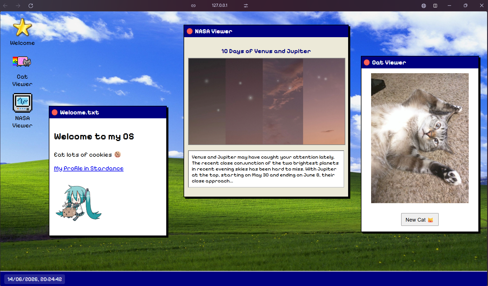

# MyWebOS
This is my own operating system that can run on the web. I used HTML, CSS, and JavaScript to create it.

## It has 3 apps/features:
- Welcome - an app that opens whenever someone accesses the page, containing basic information and a picture of Miku =)
- Cat Viewer - an app that shows a picture of a cat whenever you press the button
- NASA Viewer - an app that shows daily information about space

## How to use
To test my WebOS, simply go to: https://hallow303.github.io/MyownWebOS/

